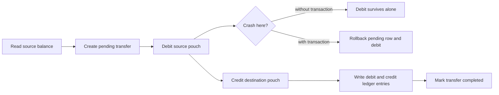

# Mission - Ledger Transfer Atomicity

## Branches

- Reference branch: `main`
- Starter branch: `mission/level-01-ledger-transfer`

`main` should stay green. The mission branch is intentionally broken so you can practice the real loop: read evidence, repair code, verify, report, and commit.

## Incident Ticket

Ava funds her quest pouch before the first Gatehouse door opens. The process crashes after the source pouch is debited but before the destination pouch is credited. Makai's promise is simple: a pouch transfer may fail, but it must not create or destroy money.

The suspected area is `src/system_design_labs/makai/ledger.py`.

## Reproduce

Switch to the starter branch, then run:

```bash
git switch mission/level-01-ledger-transfer
uv run python -m pytest labs/level_01/tests
```

Expected starter-branch result: the transaction rollback test fails because `transfer` mutates durable state before the full state transition is safe.

## Read First

Start with `labs/level_01/tests/test_ledger_transfer.py`.

Read in this order:

1. `test_crash_after_debit_rolls_back_debit`
2. `test_successful_transfer_debits_and_credits`
3. `test_insufficient_funds_rolls_back_everything`
4. `test_naive_transfer_can_lose_money_after_crash`

The naive test is a contrast path. Do not fix `naive_transfer_without_transaction`; use it to understand the production risk.

## Inspect Real Code

Open `src/system_design_labs/makai/ledger.py`.

Trace:

- `transfer`
- `naive_transfer_without_transaction`
- `balance`

Find the first durable state change inside `transfer`. Then identify what has not happened yet if the crash is raised at that point.

## Concepts To Explore

Use `GLOSSARY.md` first, then search deeper if needed:

- Invariant
- Atomicity
- Transaction
- Rollback
- Crash consistency
- Double-entry ledger

The important question is not "how do I make pytest green?" It is: which state changes must commit together for Makai's money-conservation promise to hold?

## Fix Constraints

- Change the implementation, not the tests.
- Keep the public `transfer(...) -> TransferResult` interface unchanged.
- Keep `naive_transfer_without_transaction` unsafe as the teaching contrast.
- Bind the transfer row, debit, credit, ledger entries, and status update into one all-or-nothing state transition.
- Preserve the insufficient-funds behavior: no transfer rows and no balance changes.

## Diagram Prompt

Draw the smallest useful diagram in your notes or `REPORT.md`. Keep the crash window visible.



## Report Template

Create `labs/level_01/exercises/ledger_transfer/REPORT.md` after the fix.

```md
# Report - Ledger Transfer Atomicity

## Incident
What promise did Makai break?

## Evidence
Which test failed first, and what state proved the bug?

## Root Cause
Where did durable state change before the full transfer was safe?

## Fix
What mechanism did you add, and which state changes now commit together?

## Verification
Which commands did you run, and what passed?

## Remaining Risk
What does this not solve yet, especially around broader isolation or concurrent writes?
```

## Done

- `uv run python -m pytest labs/level_01/tests` passes.
- `REPORT.md` explains the incident, evidence, root cause, fix, verification, and remaining risk.
- Commit message names the mechanism, for example:

```bash
git add src/system_design_labs/makai/ledger.py labs/level_01/exercises/ledger_transfer/REPORT.md
git commit -m "Fix Level 1 ledger transfer atomicity"
```
